# CleanSphere Pro: Housekeeping Management System

Aplikasi pemantauan kinerja staf (KPI), status kamar, inventaris, dan absensi real-time berbasis **Google Apps Script (GAS)**, **Vue.js (CDN)**, dan **Google Sheets** sebagai database.

---

## 1. Fitur Utama Sistem

### 📱 Antarmuka Staf (Mobile-First)
Didesain khusus untuk perangkat mobile guna memudahkan operasional staf di lapangan:
*   **Sistem Absensi Cepat & Validasi**: Melakukan *Clock-In* dan *Clock-Out* harian sesuai shift. Sistem secara otomatis mencatat dan menghitung keterlambatan absen/pulang jika waktu *Clock-Out* melebihi jam selesai shift yang ditentukan.
*   **Pengajuan Izin**: Formulir digital untuk mengajukan cuti dan izin sakit (disertai unggah foto bukti/surat dokter).
*   **Manajemen Pembersihan Kamar (RACS)**:
    *   Informasi kamar yang ditugaskan beserta indikator waktu pengerjaan (timer).
    *   Daftar tugas pembersihan (checklist) dinamis yang dapat diselesaikan sekaligus menggunakan fitur *Check All*.
    *   Pembaruan status kebersihan kamar secara langsung setelah selesai dibersihkan.
*   **Pembersihan Area Publik**: Checklist pemantauan kebersihan area fasilitas umum dengan status pengerjaan (*Done*, *On Progress*, *Pending*).
*   **Laporan Proyek Berkala**: Pelaporan tugas khusus harian, mingguan, atau bulanan lengkap dengan unggah foto dokumentasi hasil kerja.
*   **Pencatatan Inventaris**: Input pemakaian linen, bahan kimia, atau peralatan kebersihan beserta riwayat pemakaian staf hari ini.

### 👑 Dashboard Manager / Admin (Desktop-Optimized)
Antarmuka komprehensif bagi Manager untuk memantau dan mengonfigurasi operasional rumah sakit:
*   **Ringkasan Dashboard Eksekutif**:
    *   Visualisasi KPI kinerja staf (harian, mingguan, bulanan).
    *   Status kebersihan kamar real-time dalam grafik interaktif.
    *   Notifikasi otomatis (*Alert*) untuk barang inventaris yang mendekati batas minimum stok.
*   **Room Control Sheets**:
    *   Tampilan Grid Kamar interaktif untuk memantau status atau mengubah status secara manual.
    Tabel data dan Status Kamar : Untuk warna kode status kamar di room attendant control sheet: 
        1. OD (yellow) - OC (darkgreen) 
        2. ⁠VD (merah) - VC (green) VCI (blue) 
        3. ⁠ED (orange) 
        4. ⁠EA (gray)
        5. ⁠NS (white)
        6. ⁠RS (brown)
        7. ⁠DND (maroon)
        8. ⁠OOO (red)
        9. ⁠OOS (pink)
        10. ⁠SO (white)
        11. ⁠DL (maroon)
        12. ⁠NL (white)
        13. ⁠CO (red) 
        14. ⁠DO  (orange)
        15. ⁠MUR (yellow) 
        16. ⁠VIP (purple)
        17. ⁠COMP (creem)
    Create data kamar, dengan konsep penambahan data dinamis untuk apa saja yang perlu dicek staf dengan 2 data beranak. Data tingkat 1 (kategori) dikonfigurasi dengan tipe input tertentu yang dapat dipilih oleh admin:
    1. **"checklist"**: untuk tugas standar (hanya checkbox centang).
    2. **"in"** (Refill): mencatat kuantitas barang yang diisi ulang/masuk.
    3. **"inout"** (Change/Linen): mencatat kuantitas barang kotor keluar (`out`) dan barang bersih masuk (`in`).
    
    Contoh struktur JSON `checklist_config` di database:
    ```json
    {
      "Cleaning": {
        "type": "checklist",
        "items": ["Trash", "Bed Making", "Floor", "Toilet"]
      },
      "Change": {
        "type": "inout",
        "items": ["Bedding", "Towel"]
      },
      "Refill": {
        "type": "in",
        "items": ["Toiletries", "Water Bottle"]
      }
    }
    ``` 
    *   Riwayat lengkap perubahan status kamar untuk keperluan audit operasional beserta filter tanggal dan staff.
    *   Tugas Staff: Untuk mengatur tugas room yang perlu diurus staff, jadi ada pilih tanggal, lalu select room dan staff mana yang akan mengerjakan room tersebut.
*   **Area Control Sheets**:
    *   tabel untuk create data AREA, dari Name, ID Number, Shift(bisa isi shift lebih dari 1).
    *   Area Shift : untuk memanajemen shift beserta waktu mulai dan waktu selesai, contoh shift (morning/middle/evening/night) dan jam mulai dan jam selesai.misal shift morning jam 8 pagi sampai jam 4 sore.
    *   Staff Area Task : untuk memanajemen staff yang akan mengerjakan area pada shift tertentu setiap hari.
    *   Area Task Daily : menampilkan Data area hari ini(bisa pilih tanggal), jika Data area shiftnya ada 4, jadi di data Area 1 Area bisa ada 4 data dengan shift yang berbeda, untuk status bisa pilih :
        - Centang ✅ (green) yg menyatakan sudah di kerjakan 
        - Centang ❌ kalau belum di kerjakan 
        - Pending (yellow)
        - OOO (font red)
        - VCI centang warna blue 
        - Done (font green) untuk di kolom Remarks/ketik manual.
    beserta riwayat siapa staff yang ubah statusnya.
*   **Manajemen Inventaris**:
    *   Manajemen Stok stok barang masuk, keluar, Minimum stok.
    *   Log transaksi logistik (ledger) lengkap yang mencatat mutasi barang, penanggung jawab, dan waktu transaksi.
    *   Konfigurasi kategori inventaris secara dinamis.
*   **HouseKeeping Project**:
    *   Tabel untuk mengelola proyek yang diberikan kepada staf dari periode harian/mingguan/bulanan dan dengan foto dokumentasi yang dikirim ke google drive (bisa menggunakan file gambar atau foto kamera ponsel).
*   **project pekerjaan Staff**:
    *   Tabel untuk mengelola proyek yang diberikan kepada staf dari periode mingguan/bulanan, isi judul tugas, deskripsi, lalu unggah foto (bisa menggunakan file gambar atau foto kamera ponsel)
*   **Manajemen Staff & Shift**:
    *   Pengelolaan akun staf (tambah, edit, dan nonaktifkan akun).
    *   Konfigurasi shift kerja (jam masuk, jam pulang, dan batas toleransi absensi/keterlambatan).
    *   Laporan absensi bulanan dan rekapitulasi nilai KPI.

### ⚙️ Fitur Keamanan & Sinkronisasi Sistem
*   **Proteksi Konflik Data**: Mencegah tabrakan data (misal dua staf memperbarui kamar yang sama secara bersamaan) dengan sistem validasi versi baris (*Row Versioning*) pada kamar, serta pencatatan berbasis transaksi (*Ledger*) untuk inventaris.
*   **Keamanan Data**:
    *   Enkripsi sandi login menggunakan algoritma SHA-256 sebelum data dikirim ke server.
    *   Sesi masuk otomatis (*Auto-Login*) yang aman menggunakan token sesi aktif selama 7 hari di perangkat staf.
*   **Reset Data Otomatis**: Pengarsipan data checklist bulanan dan penyesuaian stok inventaris secara otomatis pada setiap awal bulan.
*   **Sinkronisasi Manual**: Tombol *Sync Now* di semua halaman untuk memperbarui data langsung dari database Google Sheets kapan saja.

---

## 2. Entity Relationship Diagram (ERD)

Database aplikasi ini dirancang secara relasional menggunakan Google Sheets sebagai media penyimpanan data. Berikut adalah hubungan antar tabel dalam sistem:

```mermaid
erDiagram
    tb_users ||--o{ tb_attendance : "has"
    tb_users ||--o{ tb_room_checklist : "performs"
    tb_users ||--o{ tb_area_tasks_daily : "updates"
    tb_users ||--o{ tb_housekeeping_projects : "submits"
    tb_users ||--o{ tb_staff_work_projects : "submits"
    tb_users ||--o{ tb_staff_checklist_assignments : "has_assigned"
    tb_users ||--o{ tb_sessions : "has_sessions"
    tb_shifts ||--o{ tb_users : "assigned_to"
    tb_shifts ||--o{ tb_attendance : "recorded_in"
    tb_users ||--o{ tb_leave_requests : "requests"
    
    tb_rooms ||--o{ tb_room_checklist : "tracked_in"
    tb_room_statuses ||--o{ tb_rooms : "defines_status_of"
    tb_rooms ||--o{ tb_room_status_history : "logs_history"
    tb_users ||--o{ tb_room_status_history : "changes_status"
    
    tb_rooms ||--o{ tb_room_assignments : "assigned_to"
    tb_users ||--o{ tb_room_assignments : "gets_assigned"
    
    tb_areas ||--o{ tb_staff_area_tasks : "assigned_in"
    tb_area_shifts ||--o{ tb_staff_area_tasks : "defines_shift_for"
    tb_users ||--o{ tb_staff_area_tasks : "performs_area_task"
    
    tb_areas ||--o{ tb_area_tasks_daily : "tracked_in"
    tb_area_shifts ||--o{ tb_area_tasks_daily : "recorded_in"
    
    tb_inventory_categories ||--o{ tb_inventory : "categorizes"
    tb_inventory ||--o{ tb_inventory_transactions : "logs_transactions"
    tb_users ||--o{ tb_inventory_transactions : "records_transaction"
    
    tb_checklist_master ||--o{ tb_staff_checklist_assignments : "assigned_in"
    
    tb_users {
        string user_id PK
        string username
        string password "SHA-256 Hash"
        string name
        string role "manager / staff"
        string shift_id FK
        string status "active / inactive"
    }

    tb_sessions {
        string session_token PK
        string user_id FK
        string created_at "ISO 8601 Timestamp"
        string expires_at "ISO 8601 Timestamp"
    }

    tb_shifts {
        string shift_id PK
        string shift_name "Pagi / Siang / Malam"
        string check_in_time "07:00"
        string check_out_time "15:00"
        int pre_check_in_minutes
        int pre_check_out_minutes
        boolean is_active
    }

    tb_attendance {
        string attendance_id PK
        string user_id FK
        string shift_id FK
        string date "ISO 8601 YYYY-MM-DD"
        string check_in_time "HH:mm"
        string check_out_time "HH:mm"
        string status "in / out"
    }

    tb_leave_requests {
        string request_id PK
        string user_id FK
        string leave_type "cuti / sakit / izin"
        string start_date "ISO 8601 YYYY-MM-DD"
        string end_date "ISO 8601 YYYY-MM-DD"
        string reason
        string proof_url "Google Drive URL (direct link via https://drive.google.com/uc?export=view&id=fileId)"
        string status "pending / approved / rejected"
        string approved_by FK
        string approved_at "ISO 8601 Timestamp"
    }

    tb_settings {
        string setting_id PK
        string api_key
        string folder_url "Google Drive Folder URL / Folder ID"
    }

    tb_rooms {
        string room_number PK
        string room_status FK "tb_room_statuses.status_code"
        string last_cleaned_at "ISO 8601 Timestamp"
        string last_cleaned_by FK
        string last_updated "ISO 8601 Timestamp (Row Versioning)"
        string checklist_config "JSON structure e.g. Cleaning/Change/Refill"
        string remarks
    }

    tb_room_assignments {
        string assignment_id PK
        string date "ISO 8601 YYYY-MM-DD"
        string room_number FK
        string staff_id FK
        string target_status_from "e.g. VD"
        string target_status_to "e.g. VC"
        string remarks "Instruksi tambahan"
        string status "Pending / In Progress / Completed"
    }

    tb_room_status_history {
        string history_id PK
        string room_number FK
        string old_status
        string new_status
        string changed_by FK
        string timestamp "ISO 8601 Timestamp"
        int duration_minutes
    }

    tb_room_statuses {
        string status_id PK
        string status_code "OD / OC / VD / VC / VCI / ED / EA / NS / RS / DND / OOO / OOS / SO / DL / NL / CO / DO / MUR / VIP / COMP"
        string status_name
        string color_hex
        string description
        boolean is_active
    }

    tb_areas {
        string area_id PK
        string area_name
        string id_number
        string shift_ids "Comma-separated shifts or relation"
    }

    tb_area_shifts {
        string area_shift_id PK
        string shift_name "Morning / Middle / Evening / Night"
        string start_time "HH:mm"
        string end_time "HH:mm"
    }

    tb_staff_area_tasks {
        string task_id PK
        string area_id FK
        string area_shift_id FK
        string staff_id FK
    }

    tb_area_tasks_daily {
        string task_daily_id PK
        string area_id FK
        string area_shift_id FK
        string staff_id FK
        string date "ISO 8601 YYYY-MM-DD"
        string status "Centang / Centang Silang / Pending / OOO / VCI / Done"
        string remarks
        string updated_by FK
        string updated_at "ISO 8601 Timestamp"
    }

    tb_inventory_categories {
        string category_id PK
        string category_name "Linen / Chemical / Equipment etc."
        string description
        boolean is_active
    }

    tb_checklist_master {
        string task_id PK
        string task_name "Dusting / Refill Soap / Moping Lobby"
        string task_type "Room - Cleaning / Room - Linen / Room - Refill / Public Area"
        string description
        boolean is_active
    }

    tb_staff_checklist_assignments {
        string assignment_id PK
        string user_id FK
        string task_id FK
        boolean is_enabled
    }

    tb_room_checklist {
        string checklist_id PK
        string room_number FK
        string staff_id FK
        string date "ISO 8601 YYYY-MM-DD"
        string start_time "ISO 8601 Timestamp"
        string end_time "ISO 8601 Timestamp"
        int duration_minutes
        string tasks_completed "JSON task_id list"
        string linen_changed "JSON task_id list"
        string refills "JSON task_id list"
        string status "In Progress / Completed"
        float kpi_score
    }

    tb_housekeeping_projects {
        string project_id PK
        string title
        string description
        string type "Harian / Mingguan / Bulanan"
        string staff_id FK
        string photo_url "Google Drive URL (direct link via https://drive.google.com/uc?export=view&id=fileId)"
        string date "ISO 8601 YYYY-MM-DD"
        string status "Pending / Approved / Rejected"
        string approved_by FK
        string approved_at "ISO 8601 Timestamp"
    }

    tb_staff_work_projects {
        string work_project_id PK
        string title
        string description
        string period "Mingguan / Bulanan"
        string staff_id FK
        string photo_url "Google Drive URL (direct link via https://drive.google.com/uc?export=view&id=fileId)"
        string date "ISO 8601 YYYY-MM-DD"
    }

    tb_inventory {
        string item_id PK
        string category_id FK "tb_inventory_categories.category_id"
        string item_name
        int stock_initial
        int stock_in "Dynamic sum from transactions"
        int stock_out "Dynamic sum from transactions"
        int stock_current
        int min_stock
        string remarks
    }

    tb_inventory_transactions {
        string transaction_id PK
        string item_id FK
        string user_id FK
        string type "in / out / correction"
        int quantity
        string date "ISO 8601 YYYY-MM-DD"
        string timestamp "ISO 8601 Timestamp"
        string remarks
    }
```

